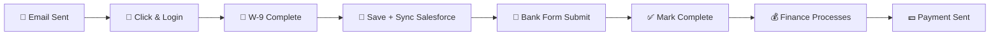

# 🍎 SNAP Emergency Assistance
## Quick-Start Guide for Program Team

> **💡 What Is This?**  
> A **one-time $100 emergency payment** to help SNAP-verified Launch participants during November 2024 when food stamp payments are delayed.

<div align="center">

### ⏰ **DEADLINE: November 4 at 5:00 PM**

</div>

---

## 📋 The Simple Version

<table>
<tr>
<td width="50%" valign="top">

### 👥 What Participants See

1. **📧 Receive email** → Request $100 assistance
2. **🔘 Click button** → Opens in email
3. **🔐 Login to portal** → See banner
4. **✋ Click "Request Assistance"** → Start process
5. **📝 Fill out 2 forms:**
   - ✅ W-9 tax form *(3 min)*
   - ✅ Bank info + e-signature *(5 min)*
6. **🎉 Done!** → Confirmation screen

</td>
<td width="50%" valign="top">

### 👨‍💼 What You Do

1. **📤 Send the email** → Eligible participants ready
2. **⏳ Wait for completion** → They do the work
3. **📊 Check TFA Forms** → Review submissions
4. **💰 Process payments** → Via finance team

</td>
</tr>
</table>

---

## 👥 Who Is Eligible?

> **✅ Participants must meet ALL criteria:**

| Requirement | Details |
|------------|---------|
| **SNAP Verified** | ✅ Automatically checked from Salesforce nightly |
| **Active Phase** | Must be in one of these phases: |
|  | • Job Foundations |
|  | • Job Readiness |
|  | • Job Launch |
|  | • GED |

<div align="center">

### 📊 Current Eligible Count

# **133** participants
*As of October 29, 2024*

</div>

> **🔄 Auto-Update:**  
> This number refreshes automatically every night at **2:00 AM** when we sync with Salesforce!

---

## 📧 How to Send the Email

### 🎯 Step 1: Access the Admin Dashboard

Navigate to: 
```
/admin/snap-assistance-notification
```

**What you'll see:**
| Element | Description |
|---------|-------------|
| 👥 **Eligible Count** | Total participants ready (133 currently) |
| 📋 **Participant List** | Names and email addresses |
| 🔘 **Action Buttons** | Send test or bulk emails |

---

### ✅ Step 2: Send a Test Email First

> **⚠️ ALWAYS test before sending to participants!**

1. 📧 Email box shows: `richardmichalka@gmail.com`
2. 🚀 Click **"Send Test"**
3. ⏱️ Check your inbox *(arrives in ~30 seconds)*
4. 📱 Review design on **desktop AND mobile**
5. ✓ Verify everything looks perfect!

---

### 🚀 Step 3: Send to Everyone

```
┌─────────────────────────────────────┐
│  1. Click "Send to [133] Participants" │
│  2. Confirm in the popup              │
│  3. ✓ Done! Emails send immediately   │
└─────────────────────────────────────┘
```

> **✨ That's it!** The system handles everything automatically.

---

## 🔄 The Complete Participant Journey

### 📧 Step 1: They Receive the Email

<table>
<tr>
<td width="50%">

**📬 Email Details:**
- **From:** CrossPurpose Launch  
  `explorer@crosspurpose.org`
- **Subject:** 🍎 Emergency Assistance Available: Request Your $100 Today

</td>
<td width="50%">

**🎨 Visual Elements:**
- ✅ CrossPurpose logo
- ✅ Beautiful hero image
- ✅ Clear $100 message
- ✅ Big red CTA button
- ✅ Deadline reminder

</td>
</tr>
</table>

### 🔘 Step 2: They Click the Button

```
Email Button → Portal Website → Login (if needed) → Assistance Page
```

---

### 🎯 Step 3: They See the Request Page

> **Welcome Screen Includes:**

| Element | Description |
|---------|-------------|
| 🍎 **Apple Icon** | Friendly visual branding |
| 💬 **Welcome Message** | Warm, clear explanation |
| 💵 **$100 Payment Info** | What they're getting |
| 📝 **Requirements List** | W-9 + bank info needed |
| ⏰ **Deadline Notice** | November 4, 5 PM |
| 🚀 **"Get Started" CTA** | Big, obvious button |

---

### 📄 Step 4: W-9 Tax Form

**🔐 Secure Form Process:**

```
Click "Complete W-9" 
    ↓
Track1099/Avalara Opens (Professional Tax Service)
    ↓
Fill Required Fields:
  • Name
  • Address  
  • Social Security Number
  • Tax Classification
    ↓
⏱️ Takes ~3 minutes
    ↓
✅ Auto-saves to database
```

> **⚙️ Behind the Scenes:**
> - ✓ Portal marks W-9 complete
> - ✓ Salesforce syncs (background)
> - ✓ Page shows "W-9 Completed!" checkmark

---

### 🏦 Step 5: Bank Account Information

**💳 TFA Forms Embedded:**

<table>
<tr>
<td width="70%">

**Required Fields:**
- ✏️ First name, last name
- 📧 Email address
- 🔢 Bank routing number *(9 digits)*
- 💰 Account number
- ✍️ **E-signature** *(scroll to bottom)*

</td>
<td width="30%">

> **⚠️ Important:**  
> Must scroll down and **sign electronically** at the bottom!

</td>
</tr>
</table>

### ✅ Step 6: Confirm Submission

> **Safety Check:**

```
□ "I confirm that I have completed and submitted 
   the direct deposit form above"
```

- ⛔ Prevents accidental submissions
- 🔒 Submit button disabled until checked

---

### 🎉 Step 7: Submit & Complete

```
Click "Submit My Request"
    ↓
✅ Success Screen: "Request Submitted!"
    ↓
Return to Dashboard
    ↓
🚫 Banner disappears (no duplicate requests)
```

---

## 🎯 What Happens Behind the Scenes

### ✨ Automatic Magic Flow



| Step | What Happens | Who Sees It |
|------|-------------|-------------|
| 1️⃣ | **Email sent** → Person clicks → Portal identifies user | Participant |
| 2️⃣ | **W-9 completed** → Auto-saves to database + Salesforce syncs | System |
| 3️⃣ | **Bank form submitted** → Logged in database | System |
| 4️⃣ | **Request marked complete** → Banner disappears | Participant |
| 5️⃣ | **Finance team** sees submission in TFA Forms | Finance |
| 6️⃣ | **Payment processed** → Sent to bank account | Finance → Participant |

---

### 📊 Data We Track

> **Comprehensive Tracking System:**

| Data Point | Source | Update Frequency |
|-----------|--------|------------------|
| ✅ **SNAP Verified Status** | Salesforce | Nightly at 2 AM |
| ✅ **W-9 Completion** | Track1099 API | Real-time |
| ✅ **Bank Form Submission** | TFA Forms | Real-time |
| ✅ **Completion Timestamp** | Portal Database | Real-time |
| ✅ **Duplicate Prevention** | Portal Database | Real-time |

---

## 💰 Finance Team: Processing Payments

### 🔗 TFA Forms Dashboard Links

<table>
<tr>
<td width="50%">

**🏦 Direct Deposit Form**
```
https://www.tfaforms.com/5201110
```
*For participants with bank accounts*

</td>
<td width="50%">

**🎁 Non-Bank Form (Gift Cards)**
```
https://www.tfaforms.com/5201192
```
*For participants without bank accounts*

</td>
</tr>
</table>

---

### 📋 What Each Submission Includes

| Field | Description |
|-------|-------------|
| 👤 **Participant Name** | Full legal name |
| 📧 **Email Address** | Contact email |
| 🔢 **Bank Routing Number** | 9-digit routing # |
| 💰 **Account Number** | Bank account # |
| ✍️ **E-Signature** | Legally binding signature |

---

### 🔄 Processing Workflow

```
Step 1: Export from TFA Forms
   ↓
Step 2: Verify all required fields complete
   ↓
Step 3: Process direct deposits via payment system
   ↓
Step 4: Handle gift card requests separately
   ↓
✅ Done!
```

---

## ❓ Frequently Asked Questions

<details>
<summary><b>💳 "What if someone doesn't have a bank account?"</b></summary>

<br>

> **Solution: Gift Card Option** 🎁

There's a link that says: *"Don't have a bank account? Click here"*

- Takes them to alternative TFA form
- Request **gift card** instead of direct deposit
- Finance team processes manually

</details>

<details>
<summary><b>🔄 "Can someone request this twice?"</b></summary>

<br>

> **❌ NO! System prevents duplicates:**

| Prevention Method | How It Works |
|------------------|--------------|
| ✅ **Database Flag** | Marked as complete after submission |
| ✅ **Banner Removal** | Disappears from their dashboard |
| ✅ **Email List** | Won't be emailed again |
| ✅ **Submit Block** | System blocks duplicate submissions |

</details>

<details>
<summary><b>⏸️ "What if they start but don't finish?"</b></summary>

<br>

> **✅ Progress is Saved!**

- 🔓 Can close browser and return later
- 🏷️ Banner stays visible until complete
- 💾 W-9 completion is saved automatically
- ▶️ Pick up exactly where they left off

</details>

<details>
<summary><b>✅ "How do we know they actually submitted the TFA form?"</b></summary>

<br>

> **Multiple Verification Layers:**

1. ☐ **Required confirmation checkbox** → "I confirm I submitted the form"
2. 🔒 **Submit button disabled** until checked
3. 👁️ **Finance team verifies** in TFA Forms backend
4. 🛡️ **Fraudulent requests** caught during verification

</details>

<details>
<summary><b>📄 "What about the W-9 for tax purposes?"</b></summary>

<br>

> **IRS Compliance Handled Professionally:**

| Aspect | Details |
|--------|---------|
| 📋 **Requirement** | IRS mandates W-9 for payments >$600/year |
| 🏢 **Provider** | Track1099 (owned by Avalara - major tax company) |
| 🔐 **Security** | Encrypted and secure forms |
| ⏳ **Expiration** | 3 years (standard IRS requirement) |
| 🔄 **Sync** | Auto-syncs to Salesforce Leader File |

</details>

<details>
<summary><b>⏱️ "How long does the whole process take?"</b></summary>

<br>

**👥 For Participants:**

| Task | Time |
|------|------|
| 📧 Email to completion | ~10 minutes total |
| 📝 W-9 form | ~3 minutes |
| 🏦 Bank form | ~5 minutes |
| ✍️ E-signature | ~2 minutes |

**👨‍💼 For Program Staff:**

| Task | Time |
|------|------|
| 📤 Sending emails | ~2 minutes |
| 💰 Processing payments | Depends on payment system |
| ✅ Verifying in TFA Forms | ~5 minutes per batch |

</details>

---

## 📊 Tracking & Reporting

### 🎯 Real-Time Eligibility Dashboard

> **Access:** `/admin/snap-assistance-notification`

**Live Data Display:**

| Metric | Description |
|--------|-------------|
| 📈 **Total Count** | Auto-updates from Salesforce |
| 📋 **Participant List** | Names + emails |
| 🎯 **Current Phase** | Job Foundations/Readiness/Launch/GED |
| 👨‍🏫 **Coach Assignment** | Their assigned coach |

---

### 📥 CSV Export

> **Pre-Generated File:** `snap-job-ged-list-2025-10-29.csv`

**Includes:**
- ✅ Name
- ✅ Email  
- ✅ Phone
- ✅ Current Phase
- ✅ Coach Name
- ✅ Coach Email
- ✅ SNAP Confirmed Date

**🔄 Generate Updated List:**

```bash
npx tsx scripts/get-snap-job-ged-list.ts
```

---

### 📈 Statistics Dashboard

**Run analytics script:**

```bash
npx tsx scripts/check-snap-count-change.ts
```

**Shows:**

| Stat | Description |
|------|-------------|
| 📊 **Total SNAP Confirmed** | All verified participants |
| 📍 **Phase Breakdown** | Count per phase |
| ✅ **Already Requested** | Completed requests |
| 📧 **Pending Emails** | Still need notification |

---

## ⏰ Timeline & Important Dates

### 📅 Active Period: Now → November 4 at 5:00 PM

<div align="center">

```
🟢 OPEN FOR SUBMISSIONS
```

</div>

> **Participants can submit requests during this window**

---

### 🌙 Nightly Auto-Sync (2:00 AM)

**Automated Salesforce Sync:**

```
2:00 AM Daily
    ↓
Sync with Salesforce
    ↓
Update SNAP Verification Status
    ↓
Refresh Eligible Participant List
    ↓
✅ See updated count in morning
```

| What Updates | Impact |
|-------------|--------|
| 🔄 **SNAP Status** | Newly verified participants added |
| 📊 **Eligible Count** | Number may increase/decrease |
| 📋 **Participant List** | Fresh data every morning |

---

### 🔴 After November 4 at 5:00 PM

```
APPLICATIONS CLOSED
```

- ⛔ **Deadline passed**
- 📢 **Banner shows closure message**
- 🤝 **Late submissions** → Case-by-case basis

---

## 🚨 Troubleshooting Guide

<details>
<summary><b>🚫 "A participant says they don't see the banner"</b></summary>

<br>

**🔍 Diagnostic Checklist:**

| Check | How to Verify |
|-------|--------------|
| ☐ **SNAP Verified?** | Check Salesforce `Confirmed_SNAP__c` field |
| ☐ **Correct Phase?** | Must be Job Foundations/Readiness/Launch/GED |
| ☐ **Already Complete?** | Check if they submitted already |
| ☐ **Correct Dashboard?** | Must be on `/dashboard/explorer` (not old dashboard) |

**✅ Solution:**
- Run nightly sync manually **OR**
- Update SNAP status in Salesforce

</details>

<details>
<summary><b>📝 "Someone can't complete the W-9"</b></summary>

<br>

**🐛 Common Issues:**

| Problem | Solution |
|---------|----------|
| 🚫 **Browser blocks popup** | → Enable popups for portal |
| 🛡️ **Ad blocker interference** | → Disable temporarily |
| 🕰️ **Outdated browser** | → Use latest Chrome/Firefox/Safari |

**🔧 Workaround:**
> Coach can help complete W-9 separately via admin portal

</details>

<details>
<summary><b>⚠️ "TFA Forms isn't loading"</b></summary>

<br>

**💡 Quick Fixes:**

```
1. ✓ Check internet connection
2. ✓ Try different browser (Chrome recommended)
3. ✓ Clear cache & cookies
4. ✓ Verify they're on /snap-assistance page (not modal)
```

</details>

<details>
<summary><b>❌ "Finance says they don't see a submission"</b></summary>

<br>

**🔎 Verification Steps:**

| Step | Action |
|------|--------|
| 1️⃣ | Check if they clicked "Submit" on TFA form |
| 2️⃣ | Verify in TFA Forms dashboard |
| 3️⃣ | Confirm they checked confirmation checkbox |
| 4️⃣ | Look at database for completion status |

</details>

---

## 📱 Participant Experience Journey

### 🎬 Complete Flow (Phone or Computer)

<div align="center">

```
📧 Email → 🔘 Click → 🔐 Login → 📝 Forms → ✅ Complete
```

</div>

**Step-by-Step Experience:**

| # | What They See | What Happens |
|---|--------------|--------------|
| 1️⃣ | **📧 Email Arrives** | Beautiful, professional, personalized |
| 2️⃣ | **🔘 Click Button** | → `portal.crosspurpose.org` |
| 3️⃣ | **🔐 Login** | Normal portal credentials |
| 4️⃣ | **🍎 Welcome Page** | Clear explanation + apple icon |
| 5️⃣ | **🚀 "Get Started"** | → W-9 step begins |
| 6️⃣ | **📝 Complete W-9** | Secure form (3 min) |
| 7️⃣ | **⏳ "Processing..."** | Spinner while verifying |
| 8️⃣ | **✅ "W-9 Completed!"** | Green checkmark |
| 9️⃣ | **➡️ "Continue"** | → Bank info step |
| 🔟 | **🏦 Bank Form** | Fill + e-sign at bottom |
| 1️⃣1️⃣ | **☑️ Confirmation Box** | "I confirm I submitted" |
| 1️⃣2️⃣ | **📤 "Submit Request"** | Final submission |
| 1️⃣3️⃣ | **🎉 Success Screen!** | Big green checkmark |
| 1️⃣4️⃣ | **🏠 Back to Dashboard** | Banner gone → All set! |

---

## 🎨 Technical Details (For IT/Admin)

### 💾 Database Schema

```sql
-- SNAP Verification Status
confirmedSNAP = true

-- Assistance Request Completion  
snapEmergencyAssistanceCompleted = true
snapEmergencyAssistanceCompletedAt = [timestamp]
```

---

### 🗺️ Application Routes

| Route | Purpose |
|-------|---------|
| `/admin/snap-assistance-notification` | 👨‍💼 Email admin dashboard |
| `/snap-assistance` | 👥 Participant request flow |
| `/dashboard/explorer` | 🏠 Banner display location |

---

### 🔌 API Endpoints

<table>
<tr>
<td width="50%">

**GET Endpoints:**
```
/api/snap-assistance/status
```
*Check participant eligibility*

```
/api/snap-assistance/send-notification
```
*Get eligible participant list*

</td>
<td width="50%">

**POST Endpoints:**
```
/api/snap-assistance/complete
```
*Mark request as complete*

```
/api/snap-assistance/send-notification
```
*Send bulk emails*

</td>
</tr>
</table>

---

### 🌐 External Services Integration

| Service | Purpose | Integration |
|---------|---------|-------------|
| 📧 **Brevo** | Email delivery | SMTP API |
| 📄 **Track1099/Avalara** | W-9 tax forms | Embedded iframe + API |
| 📝 **TFA Forms** | Direct deposit forms | Embedded forms |
| ☁️ **Salesforce** | SNAP verification | Nightly sync |

---

## ✅ Success Metrics & Analytics

### 📊 Key Metrics to Track

| # | Metric | Source |
|---|--------|--------|
| 1️⃣ | **Email Open Rate** | Brevo dashboard |
| 2️⃣ | **Click-Through Rate** | Brevo analytics |
| 3️⃣ | **W-9 Completions** | Database query |
| 4️⃣ | **Bank Form Submissions** | TFA Forms count |
| 5️⃣ | **Payments Processed** | Finance records |
| 6️⃣ | **Avg Completion Time** | Timestamp analysis |

---

### 📈 Expected Success Rates

<table>
<tr>
<td width="50%">

**Engagement Funnel:**

| Stage | Expected Rate |
|-------|--------------|
| 📧 **Email Open** | 40-60% |
| 🔘 **Click-Through** | 60-80% of opens |
| 🚀 **Start Process** | 80-90% of clicks |
| 📝 **Complete W-9** | 90-95% of starts |
| 🏦 **Submit Bank Info** | 95-98% of W-9s |
| 💵 **Successful Payment** | 98-100% |

</td>
<td width="50%">

**Impact Projection:**

<div align="center">

### 133 Eligible

### ↓

### ~80 Complete

### ↓

# $8,000

**Total Distributed**

</div>

> **💙 Huge impact for families in need!**

</td>
</tr>
</table>

---

## 💬 How to Explain This to Participants

### 🗣️ Simple Talking Points

> **💰 What It Is:**  
> *"We're offering a one-time $100 payment to help with food and essentials since SNAP payments are delayed."*

> **⏱️ How Easy:**  
> *"It's super easy - just takes about 10 minutes online. You'll fill out a tax form and give us your bank info."*

> **🔐 Security:**  
> *"It's completely safe and secure - same companies that banks use. Your information is encrypted."*

> **💳 Payment Method:**  
> *"You'll get the money in your bank account. If you don't have a bank account, we can send a gift card instead."*

> **⏰ Deadline:**  
> *"The deadline is November 4 at 5 PM, so don't wait!"*

> **📧 Access:**  
> *"Just check your email - we sent you a link. Or login to your portal and you'll see a banner."*

---

## 🎯 Key Points for Coaches

### ✅ Pre-Launch Checklist

<table>
<tr>
<td width="50%">

**Before Sending:**

- ☑️ Verify list (133 people)
- ☑️ Send test email
- ☑️ Check on desktop + mobile
- ☑️ Confirm finance team ready
- ☑️ Brief all coaches

</td>
<td width="50%">

**After Sending:**

- 📊 Monitor completion rates
- 📞 Follow up non-completers
- 🤝 Help with tech issues
- ✉️ Answer questions
- 🎉 Celebrate impact!

</td>
</tr>
</table>

---

### 💬 Common Participant Questions

<details>
<summary><b>❓ "Is this a scam?"</b></summary>

**Answer:** No! It's from CrossPurpose - check the email address (`explorer@crosspurpose.org`) and the portal website you normally use.
</details>

<details>
<summary><b>❓ "Why do I need to fill out a W-9?"</b></summary>

**Answer:** The IRS requires it for any financial assistance. It's just like when you start a new job!
</details>

<details>
<summary><b>❓ "Is my information safe?"</b></summary>

**Answer:** Absolutely! We use professional services (Track1099 is owned by Avalara, a huge tax company). Everything is encrypted.
</details>

<details>
<summary><b>❓ "When will I get the money?"</b></summary>

**Answer:** After our finance team reviews your submission, which happens within a few days of submitting.
</details>

<details>
<summary><b>❓ "Can I get this more than once?"</b></summary>

**Answer:** This is a one-time emergency payment for November 2024.
</details>

<details>
<summary><b>❓ "I don't have a bank account, what do I do?"</b></summary>

**Answer:** Click the "Don't have a bank account?" link and we'll send you a gift card instead!
</details>

---

## 📞 Contact Directory

### 🆘 Support Team

| Issue Type | Contact | Purpose |
|-----------|---------|---------|
| 👥 **Participant Support** | `explorer@crosspurpose.org` | Walk through process, general help |
| 💻 **Technical Issues** | Richard Michalka | Website bugs, email delivery |
| 💰 **Finance/Payments** | Lisa Cacciatore | Processing, bank transfers, gift cards |
| 📋 **Program Policy** | Cynthia Lopez | Eligibility, deadlines, extensions |

---

<div align="center">

> **💡 Quick Tip:**  
> Route questions to the right person for fastest resolution!

</div>

---

## 📋 Pre-Launch Checklist

### ✅ Technical Readiness

- [x] **Database migration applied** ✅ *(DONE)*
- [ ] **Test email sent and reviewed**
- [ ] **Email checked on mobile device**
- [ ] **TFA Forms access confirmed**

### 👥 Team Readiness

- [ ] **Coaches briefed on program**
- [ ] **Finance team ready to process**
- [ ] **Support plan in place for questions**

### 📊 Data Verification

- [ ] **Participant count verified** *(133 people)*
- [ ] **Deadline communicated** *(Nov 4, 5 PM)*

<div align="center">

**🎯 All systems ready to launch!**

</div>

---

## 🎉 Community Impact

<div align="center">

# 💙 Making a Real Difference

</div>

<table>
<tr>
<td width="50%">

### 📊 By the Numbers

| Metric | Value |
|--------|-------|
| 👨‍👩‍👧‍👦 **Families Helped** | 133 families |
| 💵 **Per Family** | $100 each |
| 💰 **Total Impact** | $13,300 |
| 🕒 **Critical Timing** | SNAP delay period |

</td>
<td width="50%">

### 💝 What This Means

- 🛒 **Groceries** for a week
- 🍼 **Diapers** and essentials
- 😌 **Relief** during delays
- 🤝 **Community** support shown
- ✨ **Trust** building
- 💙 **Hope** during hardship

</td>
</tr>
</table>

<div align="center">

---

> ### **This is why we do what we do!** 💙
> *Showing up for our community when they need us most*

---

</div>

---

## 📚 Additional Resources

<table>
<tr>
<td width="50%">

### 👨‍💼 For Staff

| Document | Purpose |
|----------|---------|
| 📘 `SNAP_EMERGENCY_ASSISTANCE.md` | Technical docs |
| 📗 `SNAP_ASSISTANCE_IMPLEMENTATION_SUMMARY.md` | Implementation details |
| 📙 `SNAP_EMAIL_NOTIFICATION_GUIDE.md` | Email system guide |

</td>
<td width="50%">

### 👥 For Participants

| Resource | Link |
|----------|------|
| 📖 **Simple Explanation** | `SNAP_ASSISTANCE_USER_FLOW_EXPLAINED.md` |
| 🌐 **Direct Access** | `portal.crosspurpose.org/snap-assistance` |

</td>
</tr>
</table>

---

## 🚀 Ready to Launch!

<div align="center">

### ✨ Everything is Set Up and Tested! ✨

</div>

<table>
<tr>
<td align="center" width="20%">

### 1️⃣
**✅ System**  
Ready

</td>
<td align="center" width="20%">

### 2️⃣
**✅ Emails**  
Beautiful

</td>
<td align="center" width="20%">

### 3️⃣
**✅ Process**  
Smooth

</td>
<td align="center" width="20%">

### 4️⃣
**✅ 133**  
Waiting

</td>
<td align="center" width="20%">

### 5️⃣
**✅ Deadline**  
Clear

</td>
</tr>
</table>

<div align="center">

---

# 🍎

### **Just click that "Send" button and help some families!**

---

> **Questions?**  
> Ask **Richard**, **Cynthia**, or **Lisa** anytime!

</div>

---

<div align="center">

**Last Updated:** *October 30, 2024*  
**Status:** 🟢 *Ready for Production*  
**Prepared by:** *Richard Michalka*

</div>
