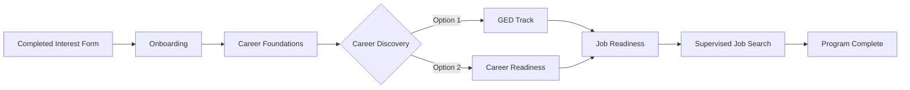

# Phase System

The Cross Purpose program guides participants through a structured journey with clearly defined phases. Each phase represents a milestone in the participant's path toward discovering and pursuing their purpose.

## Phase Overview



## Phase Definitions

<AccordionGroup>
  <Accordion title="1. Completed Interest Form" icon="file-signature">
    **Description**: Initial interest in the program has been expressed
    
    **Requirements**:
    - Interest form submitted
    
    **Duration**: Immediate (automated upon form submission)
    
    **Gift Card**: None
  </Accordion>

  <Accordion title="2. Onboarding" icon="door-open">
    **Description**: Participant is completing initial program requirements
    
    **Requirements**:
    - Registration completed
    - Program enrollment confirmed
    - Pre-program survey submitted
    - Personal strengths assessment completed
    - Barriers assessment completed
    
    **Duration**: Typically 1-2 weeks
    
    **Gift Card**: None
  </Accordion>

  <Accordion title="3. Career Foundations" icon="building">
    **Description**: Building foundational career skills and understanding
    
    **Requirements**:
    - Initial coaching session completed
    - Participant actively engaged with coach
    
    **Duration**: 2-4 weeks
    
    **Gift Card**: **$50** (triggered upon completion)
  </Accordion>

  <Accordion title="4. Career Discovery" icon="compass">
    **Description**: Exploring career options and making educational decisions
    
    **Requirements**:
    - Career Development form submitted
    - Educational pathway chosen (GED or Career Readiness)
    
    **Duration**: 2-6 weeks
    
    **Gift Card**: None (decision point)
  </Accordion>

  <Accordion title="5a. GED Track" icon="graduation-cap">
    **Description**: Pursuing GED completion
    
    **Requirements**:
    - Career Development form indicates "GED Participant"
    - Active engagement in GED preparation
    
    **Duration**: 3-12 months (varies by individual)
    
    **Gift Card**: **$75** (upon GED completion)
  </Accordion>

  <Accordion title="5b. Career Readiness" icon="briefcase">
    **Description**: Building job-ready skills
    
    **Requirements**:
    - Career Development form indicates "No GED Needed"
    - Participating in career readiness activities
    
    **Duration**: 2-6 months
    
    **Gift Card**: **$75** (upon completion)
  </Accordion>

  <Accordion title="6. Job Readiness" icon="user-tie">
    **Description**: Final preparation for job search
    
    **Requirements**:
    - Completed either GED or Career Readiness track
    - Job search preparation activities completed
    - Resume prepared
    - Interview skills developed
    
    **Duration**: 1-3 months
    
    **Gift Card**: None
  </Accordion>

  <Accordion title="7. Supervised Job Search" icon="magnifying-glass">
    **Description**: Actively searching for employment with coach support
    
    **Requirements**:
    - Job Readiness phase completed
    - Active job search with regular check-ins
    - Coach-supervised applications and interviews
    
    **Duration**: 1-6 months
    
    **Gift Card**: None
  </Accordion>

  <Accordion title="8. Program Complete" icon="trophy">
    **Description**: Successfully completed the Cross Purpose program
    
    **Requirements**:
    - Program Completion form submitted by coach
    - Employment secured OR
    - Educational goals achieved
    
    **Terminal Phase**: Yes (successful completion)
    
    **Gift Card**: **$100** (final completion bonus)
  </Accordion>

  <Accordion title="9. No Longer Pursuing" icon="circle-xmark">
    **Description**: Participant has discontinued the program
    
    **Requirements**:
    - No Longer Pursuing form submitted by coach
    - No subsequent coaching forms submitted
    
    **Terminal Phase**: Yes (unless participant re-engages)
    
    **Gift Card**: None
    
    **Note**: If participant submits new coaching forms after NLP, they are considered re-engaged and phase calculation resumes normally
  </Accordion>
</AccordionGroup>

## Phase Calculation Logic

The system automatically calculates participant phases based on form submissions:

<Steps>
  <Step title="Check Terminal Phases">
    First checks if participant has completed the program or is no longer pursuing
  </Step>
  <Step title="Check Re-engagement">
    For NLP status, verifies no coaching forms exist after the NLP form date
  </Step>
  <Step title="Evaluate Progress">
    Checks coaching forms in chronological order to determine current phase
  </Step>
  <Step title="Update Database">
    Stores calculated phase in both PostgreSQL and syncs to Salesforce
  </Step>
</Steps>

## Gift Card Triggers

Participants earn gift cards at key milestones:

| Phase | Gift Card Amount | Trigger |
|-------|-----------------|---------|
| Career Foundations → Career Discovery | $50 | Career Development form submission |
| GED completion | $75 | GED completion documented |
| Career Readiness completion | $75 | Career readiness completion documented |
| Program Complete | $100 | Program Completion form submitted |

**Total Possible**: $225 per participant

## Phase Transitions

### Automatic Transitions
- Interest Form → Onboarding (upon interest form submission)
- Onboarding → Career Foundations (upon all onboarding steps completion)

### Coach-Triggered Transitions
- Career Foundations → Career Discovery (Initial coaching session)
- Career Discovery → GED/Career Readiness (Career Development form)
- Job Readiness → Supervised Job Search (Coaching form submission)
- Supervised Job Search → Program Complete (Program Completion form)
- Any phase → No Longer Pursuing (NLP form submission)

## Technical Implementation

### Database Storage

```typescript
// Current phase stored in User model
model User {
  id           String  @id @default(cuid())
  currentPhase String? @default("Completed Interest Form")
  // ... other fields
}

// Phase calculation handled by PhaseManager
import { PhaseManager } from '@/lib/services/phase-manager';

const phaseManager = new PhaseManager();
const currentPhase = await phaseManager.calculatePhase(userId);
```

### Salesforce Sync

Phase changes automatically sync to Salesforce Contact records:

```typescript
await salesforceService.updateContact(contactId, {
  Program_Phase__c: newPhase,
  Phase_Updated_Date__c: new Date().toISOString()
});
```

## Analytics & Reporting

View phase distribution across all participants:

<Card title="Phase Analytics" icon="chart-bar" href="/admin/analytics/overview">
  Access comprehensive phase progression analytics in the admin dashboard
</Card>

## Troubleshooting

<AccordionGroup>
  <Accordion title="Phase Not Updating">
    **Common Causes**:
    - Coaching form not properly saved
    - Salesforce sync delayed
    - Form type incorrect
    
    **Solution**: Use Phase Audit tool at `/admin/phase-audit`
  </Accordion>

  <Accordion title="Incorrect Phase Calculated">
    **Common Causes**:
    - Missing coaching forms
    - Forms submitted out of order
    - Re-engagement not detected
    
    **Solution**: Review coaching form history and run bulk phase fix
  </Accordion>

  <Accordion title="Gift Card Not Triggered">
    **Common Causes**:
    - Phase transition not recorded
    - Track1099 integration issue
    - Missing participant W-9
    
    **Solution**: Check Track1099 service logs and W-9 status
  </Accordion>
</AccordionGroup>

## Related Documentation

- [SNAP Assistance Program](/cp/SNAP-Assistance)
- [Coaching Forms](/cp/coaching-forms)
- [Salesforce Integration](/cp/salesforce-integration)
- [Gift Card System](/cp/gift-cards)

---

<Info>
  The phase system is continuously monitored and audited. Contact administrators if you notice any discrepancies.
</Info>

